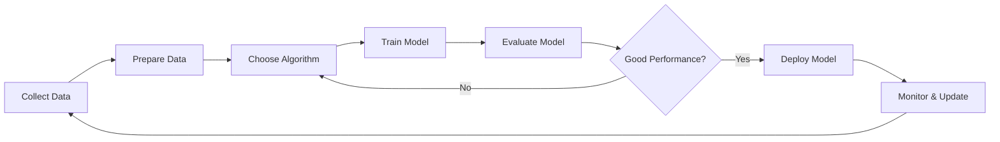

# Chapter 1: Introduction to Machine Learning

## 📖 Table of Contents
- [What is Machine Learning?](#what-is-machine-learning)
- [Why Machine Learning?](#why-machine-learning)
- [Traditional Programming vs Machine Learning](#traditional-programming-vs-machine-learning)
- [Brief History of Machine Learning](#brief-history-of-machine-learning)
- [Key Terminology](#key-terminology)

---

## What is Machine Learning?

**Machine Learning (ML)** is a subset of Artificial Intelligence (AI) that enables computers to learn and improve from experience without being explicitly programmed. Instead of following pre-defined rules, ML algorithms identify patterns in data and make decisions or predictions based on those patterns.

### Simple Definition
> "Machine Learning is the science of getting computers to learn and act like humans do, and improve their learning over time in an autonomous fashion, by feeding them data and information in the form of observations and real-world interactions."

### Real-World Analogy
Think of how you learned to ride a bicycle:
- You didn't read the exact physics equations
- You tried, fell, adjusted, and tried again
- Your brain learned patterns: "lean left to turn left, pedal faster to balance better"
- After practice, you could ride without thinking

Machine Learning works similarly - it learns from experience (data) rather than explicit instructions.

---

## Why Machine Learning?

### Problems Too Complex for Traditional Programming

Some problems are too complex to solve with traditional rule-based programming:

1. **Image Recognition**: Writing rules to identify a cat in millions of images is nearly impossible
2. **Speech Recognition**: Human speech varies greatly - accents, tone, speed
3. **Spam Detection**: Spam patterns constantly evolve
4. **Recommendation Systems**: Predicting what you'll like based on billions of user interactions

### Benefits of Machine Learning

✅ **Handles Complex Patterns**: Discovers patterns humans can't see  
✅ **Adapts to Change**: Updates as new data comes in  
✅ **Scales Efficiently**: Can process massive datasets  
✅ **Automates Decision-Making**: Reduces human intervention  
✅ **Continuous Improvement**: Gets better with more data

---

## Traditional Programming vs Machine Learning

### Traditional Programming

```
Input Data + Program (Rules) → Output
```

**Example**: Calculate if a student passes
```python
# Traditional approach - explicit rules
def check_pass(marks):
    if marks >= 40:
        return "Pass"
    else:
        return "Fail"
```

### Machine Learning

```
Input Data + Output (Examples) → Program (Model)
```

**Example**: Learn what makes a student pass
```python
# ML approach - learn from examples
# Given: Historical data of marks and results
# Model learns: The pattern that marks >= 40 means pass
model.fit(historical_marks, historical_results)
model.predict(new_student_marks)  # Model decides
```

### Comparison Diagram

**[PLACEHOLDER FOR DIAGRAM]**  
*Create a side-by-side flowchart comparing:*
- *Left side: Traditional Programming flow (Input + Rules → Output)*
- *Right side: ML flow (Input + Output → Rules/Model)*
- *Use different colors and icons to make it visually distinct*

---

## Brief History of Machine Learning

### Timeline of Key Milestones

| Year | Milestone |
|------|-----------|
| **1950** | Alan Turing proposes "Turing Test" - can machines think? |
| **1956** | Term "Artificial Intelligence" coined at Dartmouth Conference |
| **1957** | Frank Rosenblatt invents the Perceptron (first neural network) |
| **1967** | Nearest Neighbor algorithm developed |
| **1980s** | Backpropagation algorithm popularized for training neural networks |
| **1997** | IBM's Deep Blue defeats chess champion Garry Kasparov |
| **2006** | Geoffrey Hinton introduces "Deep Learning" |
| **2011** | IBM Watson wins Jeopardy! |
| **2012** | AlexNet wins ImageNet competition (Deep Learning revolution) |
| **2016** | AlphaGo defeats world Go champion Lee Sedol |
| **2017** | Transformer architecture introduced (basis for ChatGPT) |
| **2020s** | Large Language Models (GPT, BERT) and Generative AI boom |

### Evolution Visualization

**[PLACEHOLDER FOR TIMELINE GRAPHIC]**  
*Create a horizontal timeline infographic showing:*
- *Major milestones from 1950 to present*
- *Icons representing each achievement (chess piece, brain, chat bubble, etc.)*
- *Different eras: Classical AI, ML Era, Deep Learning Era, Modern AI*

---

## Key Terminology

Before diving deeper, let's establish common ML vocabulary:

### 🎯 Core Concepts

| Term | Definition | Example |
|------|------------|---------|
| **Model** | Mathematical representation learned from data | House price predictor |
| **Algorithm** | Method used to learn patterns from data | Linear Regression, Decision Tree |
| **Training** | Process of teaching a model using data | Showing 10,000 house examples |
| **Feature** | Input variable used for prediction | House size, location, age |
| **Label** | Output or target variable | House price, spam/not spam |
| **Dataset** | Collection of data used for training/testing | 50,000 house records |

### 📊 Data Terms

| Term | Definition |
|------|------------|
| **Training Data** | Data used to train the model |
| **Test Data** | Data used to evaluate model performance |
| **Validation Data** | Data used to tune model parameters |
| **Sample** | A single row of data |
| **Feature Vector** | Array of features for one sample |

### 🎓 Learning Terms

| Term | Definition |
|------|------------|
| **Supervised Learning** | Learning with labeled examples |
| **Unsupervised Learning** | Finding patterns in unlabeled data |
| **Overfitting** | Model memorizes training data, performs poorly on new data |
| **Underfitting** | Model is too simple to capture patterns |
| **Generalization** | Model's ability to perform well on unseen data |

---

## The Machine Learning Workflow

Here's a high-level overview of how ML works:



**[PLACEHOLDER FOR WORKFLOW DIAGRAM]**  
*Create a circular workflow diagram showing:*
- *8 stages: Data Collection → Data Preparation → Model Selection → Training → Evaluation → Deployment → Monitoring → Iteration*
- *Use icons for each stage (database, cleaning tool, algorithm selection, training, chart, cloud, monitor, loop)*
- *Show it as a continuous cycle with feedback loops*

### Basic Steps Explained

1. **Collect Data**: Gather relevant data from various sources
2. **Prepare Data**: Clean, transform, and organize the data
3. **Choose Algorithm**: Select appropriate ML algorithm
4. **Train Model**: Feed data to algorithm to learn patterns
5. **Evaluate Model**: Test how well it performs
6. **Deploy Model**: Put it into production
7. **Monitor & Update**: Track performance and retrain as needed

---

## Machine Learning in the AI Ecosystem

Understanding where ML fits in the broader AI landscape:

```
Artificial Intelligence (AI)
    ├── Machine Learning (ML)
    │   ├── Deep Learning (DL)
    │   │   ├── Neural Networks
    │   │   ├── Convolutional Neural Networks (CNN)
    │   │   └── Recurrent Neural Networks (RNN)
    │   └── Traditional ML
    │       ├── Decision Trees
    │       ├── Linear Regression
    │       └── Support Vector Machines
    ├── Expert Systems
    ├── Robotics
    └── Natural Language Processing (NLP)
```

**[PLACEHOLDER FOR VENN DIAGRAM]**  
*Create a nested circles/Venn diagram showing:*
- *Outer circle: Artificial Intelligence*
- *Middle circle: Machine Learning (subset of AI)*
- *Inner circle: Deep Learning (subset of ML)*
- *Label examples in each region*
- *Use gradient colors to show the hierarchy*

---

## When to Use Machine Learning?

### ✅ Use Machine Learning When:

- Problem involves **pattern recognition** (images, speech, text)
- You have **large amounts of data** available
- Problem is **too complex** for rule-based systems
- Problem requires **adaptation** to changing conditions
- **Manual rules are difficult** to define
- You need **predictions** based on historical data

### ❌ Don't Use Machine Learning When:

- Simple **rule-based solution** works fine
- You have **insufficient data**
- Problem requires **100% accuracy** (life-critical systems without fallback)
- **Interpretability is crucial** and you can't accept black-box models
- The **cost** of ML outweighs benefits

### Decision Framework

**[PLACEHOLDER FOR DECISION TREE DIAGRAM]**  
*Create a decision tree/flowchart for "Should I Use ML?":*
- *Start: "Do you have a problem to solve?"*
- *Branches: Data availability, complexity, need for adaptation, interpretability requirements*
- *End nodes: "Use ML" or "Use Traditional Approach"*
- *Color code: Green for ML, Red for Traditional*

---

## Quick Example: House Price Prediction

Let's see a simple concrete example:

### Problem
Predict house prices based on features like size, location, and age.

### Traditional Programming Approach ❌
```python
def predict_price(size, location, age):
    # Try to write rules... but how?
    if location == "downtown":
        price = size * 500
    elif location == "suburb":
        price = size * 300
    # This becomes impossibly complex!
    return price
```

### Machine Learning Approach ✅
```python
from sklearn.linear_model import LinearRegression

# Training data (examples)
houses = [
    [1500, 'downtown', 10],  # size, location, age
    [1200, 'suburb', 5],
    [2000, 'downtown', 15],
    # ... thousands more examples
]
prices = [450000, 320000, 580000, ...]  # Actual prices

# Create and train model
model = LinearRegression()
model.fit(houses, prices)  # Model learns the pattern

# Predict new house
new_house = [1800, 'downtown', 8]
predicted_price = model.predict([new_house])
print(f"Predicted price: ${predicted_price[0]:,.2f}")
```

The model **automatically learns** the relationship between features and price!

---

## What's Next?

Now that you understand what Machine Learning is and why it's powerful, we'll dive into:

→ **[Chapter 2: Types of Machine Learning](./02_types_of_ml.md)** - Learn about different approaches to ML

---

## 📚 Additional Resources

- **Book**: "The Hundred-Page Machine Learning Book" by Andriy Burkov
- **Course**: Andrew Ng's Machine Learning course on Coursera
- **Video**: 3Blue1Brown's Neural Networks series on YouTube
- **Website**: [Machine Learning Mastery](https://machinelearningmastery.com/)

---

## 🧠 Quick Quiz

Test your understanding:

1. What's the main difference between traditional programming and machine learning?
2. Name three real-world problems where ML is better than traditional programming.
3. What are the three key components needed for machine learning? (Hint: Data + ? + ?)
4. When should you NOT use machine learning?

<details>
<summary>Click for answers</summary>

1. Traditional programming uses explicit rules (Input + Rules → Output), while ML learns rules from examples (Input + Output → Rules)
2. Any three from: image recognition, speech recognition, spam detection, recommendation systems, autonomous driving, etc.
3. Data + Algorithm + Computing Power
4. When simple rules work, insufficient data, need 100% accuracy, interpretability is crucial, or cost > benefit

</details>

---

*Next: [Types of Machine Learning →](./02_types_of_ml.md)*
